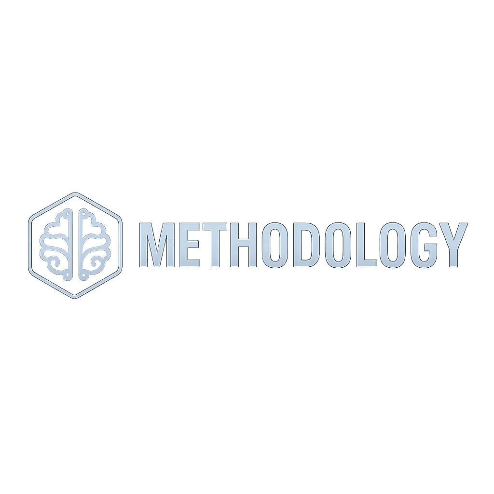

# AIDDM Methodology — Official Documentation

<p align="center">
  
</p>

Welcome to the **AIDDM Methodology Repository**, the authoritative source of standards, specifications, lifecycle definitions, and governance rules for the **AI Document-Driven Methodology (AIDDM)**.

---

## 📘 What Is AIDDM?

**AIDDM (AI Document-Driven Methodology)**  
is a modern development methodology where documents, code, and tests remain fully synchronized and auditable.

It defines:

- Document Chain  
- Development Lifecycle  
- Version governance  
- AI-assisted processes  
- Templates and compliance requirements  
- Multi-loop / multi-cycle workflow  

---

## 📚 Repository Structure

```
methodology/
├── README.md
├── CHANGELOG.md
├── LICENSE
├── docs/
│   ├── overview/
│   ├── lifecycle/
│   ├── templates/
│   ├── governance/
│   └── i18n/
└── assets/
    ├── banners/
    └── diagrams/
```

---

## 🔗 Related Repositories

- aiddm-sdk  
- aiddm-mcp  
- aiddm-ce  
- aiddm-market  

---

## 🏁 Maintained by AIDDM Institute

AI-governed. Document-driven. Fully verifiable.
