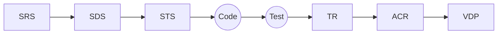

# AIDDM Document Chain Specification v1.0

## 1. Purpose

This document defines the **AIDDM Document Chain**, the set of document types, their roles, relationships, and validation rules that govern how requirements, design, tests, code, and verification artifacts remain synchronized in an AIDDM-compliant project.

The Document Chain ensures that:

- Every code change is backed by explicit requirements and design.
- Every test has a clear origin in the specification.
- Every release is traceable and auditable end-to-end.
- AI and tooling (AIDDM SDK, MCP, etc.) can reliably parse and verify artifacts.

This specification is **normative** for any project that claims AIDDM compliance.

---

## 2. Position in the AIDDM Methodology

The Document Chain is one of the core pillars of AIDDM, alongside:

- **Methodology Overview** — conceptual model, principles, lifecycle.
- **Development Lifecycle Specification** — Loop / Cycle model.
- **Governance Model** — versioning, approvals, freeze rules.

The Document Chain defines **what documents exist** and **how they must connect**.  
It is referenced by:

- AIDDM SDK validation rules.
- Templates (SRS / SDS / STS / VDP / ACR / TR).
- Governance rules for version alignment.

---

## 3. Document Types Overview

The AIDDM Document Chain consists of the following primary nodes:

| Order | Type                               | Acronym  | Primary Question                          | Producer(s)               | Consumer(s)          |
| ----- | ---------------------------------- | -------- | ----------------------------------------- | ------------------------- | -------------------- |
| 1     | Software Requirement Specification | **SRS**  | *What* must the system do?                | Product / BA / AI + human | SDS, STS, ACR        |
| 2     | Software Design Specification      | **SDS**  | *How* will the system work?               | Architect / Dev / AI      | STS, Code, ACR       |
| 3     | Software Test Specification        | **STS**  | *How* do we verify it works?              | QA / Dev / AI             | Test code, TR, ACR   |
| 4     | Implementation                     | **Code** | Implementation of SDS                     | Dev / AI                  | Tests, runtime       |
| 5     | Test Artifacts                     | **Test** | Executable verification of STS            | QA / Dev / AI             | TR, ACR              |
| 6     | Acceptance Criteria Report         | **ACR**  | Are we ready to accept this?              | QA / Product / AI         | Governance / Release |
| 7     | Test Report                        | **TR**   | What actually happened during testing?    | QA / CI / AI              | ACR / Governance     |
| 8     | Version Development Plan           | **VDP**  | What is the scope of this loop / release? | PM / Architect            | All above            |

In addition, all documents share a **common metadata/frontmatter** model.

---

## 4. Standard Metadata / Frontmatter

All AIDDM documents **must** begin with YAML frontmatter, which contains machine-readable metadata used by the AIDDM SDK.

### 4.1 Required Fields

```yaml
---
id: SRS-USER-MGMT-001           # Unique document ID within the project
title: User Management Module SRS
version: 1.2.0                  # Must align with chain (see Governance)
document_type: SRS              # One of: SRS, SDS, STS, CODE, TEST, ACR, TR, VDP
status: draft                   # draft | in-review | approved | frozen | deprecated
loop: L01                       # Loop identifier
cycle: C03                      # Optional: specific cycle
related_documents:              # IDs of related docs in the chain
  - SDS-USER-MGMT-001
  - STS-USER-MGMT-001
owners:                         # Human owners
  - role: product-owner
    name: Alice
  - role: system-analyst
    name: Bob
created_at: 2025-11-22T10:30:00Z
updated_at: 2025-11-22T13:05:00Z
tags:
  - user-management
  - auth
  - sso
---
```

---

### 4.2 Recommended Fields

- ai_generated: true|false
- ai_tools: [aiddm-sdk, openai, claude]
- reviewers: []
- governance_state: pre-freeze | frozen | post-release
- language: en | zh-TW | ...

The AIDDM SDK must be able to parse this frontmatter block and use it for:

- Version alignment checks.
- Cross-document linkage.
- Governance validation.

---

## 5. SRS — Software Requirement Specification

### 5.1 Purpose

The SRS defines what the system must do, from a requirements perspective, independent of specific implementation details.

---

### 5.2 Content Structure (Normative)

An AIDDM SRS must contain the following sections:

**1. Introduction**

- Purpose
- Scope
- Stakeholders
- Definitions / Glossary

**2. Functional Requirements (FR)**

- Each FR must have a unique ID: `FR-<DOMAIN>-<NNN>`
- Each FR must be atomic, testable, and implementation-agnostic.

**3. Business Rules (BR)**

- IDs: `BR-<DOMAIN>-<NNN>`
- Must describe constraints and rules independent of UI/implementation.

**4. Non-Functional Requirements (NFR)**

- IDs: `NFR-<CATEGORY>-<NNN>`
- Categories: performance, security, usability, reliability, etc.

**5. Integration Requirements (IR)**

- IDs: `IR-<SYSTEM>-<NNN>`
- External systems, APIs, services.

**6. Data Requirements (DR)**

- IDs: `DR-<ENTITY>-<NNN>`
- Essential data entities, attributes, constraints.

**7. Constraints, Assumptions, Risks**

---

### 5.3 SRS → SDS / STS Mapping Rules

- Every FR must be mapped to at least one SDS design element.
- Every NFR must be mapped to design or architecture decisions.
- Mapping is recorded in:
    - SDS “Origin” fields, and/or
    - A separate traceability section in SDS or a cross-ref table.

---

## 6. SDS — Software Design Specification

### 6.1 Purpose

The SDS defines how the system will fulfill the SRS, including architecture, data models, interfaces, and internal behaviors.

### 6.2 Content Structure (Normative)

**1.Architecture Overview**

- High-level architecture diagram.
- Main components and boundaries.

**2. Module / Component Design**

For each component:

- Responsibilities
- Dependencies
- Interfaces
- Mapping to FR/BR.

**3. Data Model Design**

- Entities, fields, relationships.
- Constraints (keys, indexes, uniqueness).
- Mapping to DR.

**4. API / Interface Design**

- REST/gRPC/Message contracts.
- Request/response schema.
- Error handling.

**5. Behavior & Flows**

- Sequence diagrams.
- State diagrams.
- Critical flows (login, payment, etc.)

**6. Non-functional Design Considerations**

- How NFRs are implemented in design.

---

### 6.3 SDS → SRS Mapping

Each SDS element must reference its origin:

```markdown
**Origin**
- FR: FR-USER-MGMT-001, FR-USER-MGMT-002
- NFR: NFR-PERF-001
```

The AIDDM SDK is expected to verify:

- All FRs are covered by at least one SDS element.
- No SDS element references non-existent FR/NFR.

---

## 7. STS — Software Test Specification

### 7.1 Purpose

The STS defines how the SDS (and ultimately the SRS) will be verified using tests.

### 7.2 Content Structure (Normative)

**1. Test Strategy Overview**

- Scope of testing.
- Types of tests (unit, integration, API, UI, etc.).

**2. Test Items**

- Features / components being tested.
- Reference to SDS modules.

**3. Test Scenarios**

- IDs: `TS-<DOMAIN>-<NNN>`
- Scenario description.
- Pre-conditions.
- Steps.
- Expected results.

**4. Coverage Matrix**

- FR ↔ Test Scenarios.
- NFR ↔ Stress/Load/Performance tests.

**5. Acceptance Criteria**

- What conditions must be met for acceptance.

---

### 7.3 STS ↔ SDS / SRS Mapping

Each Test Scenario must map to:

- At least one SDS element.
- At least one FR or BR (where applicable).

The SDK can check:

- No orphan test (tests without origin).
- No FR without coverage (unless explicitly deferred).

---

## 8. Code Mapping Specification

### 8.1 Purpose

Code is the concrete implementation of SDS decisions. AIDDM requires that code is not “free-floating”, but traceable to design and requirements.

### 8.2 Mapping Requirements

- Each module / service must declare its related SDS IDs (e.g. in comments or annotations).
- Key functions or classes should include references:

    ```python
    # AIDDM:ORIGIN:SDS-USER-MGMT-LOGIN-001
    # AIDDM:ORIGIN:FR-USER-MGMT-001
    def login_user(...):
        ...
    ```

- API handlers must map back to SDS API definitions.
- Data models must align with SDS data model definitions.

The SDK may:

- Parse code annotations / comments.
- Verify existence and validity of referenced IDs.

---

## 9. Test Artifacts & Test Report (TR)

### 9.1 Test Artifacts

Test artifacts (code) implement the STS.
They should include:

- Reference to STS Test Scenario IDs.
- Clear assertion of expected outcomes.

Example:

```python
# AIDDM:TEST_SCENARIO:TS-USER-MGMT-LOGIN-001
def test_login_success(client):
    ...
```

### 9.2 Test Report (TR)

The TR is a runtime artifact generated from actual test execution.

TR must contain:

- Metadata frontmatter (document_type: TR).
- Test session ID.
- Environment info.
- Summary: passed/failed/skipped.
- Per test scenario results.
- Link to STS & ACR.

Example frontmatter:

```yaml
---
id: TR-USER-MGMT-L01-C03
title: Test Report — User Management — L01 C03
version: 1.2.0
document_type: TR
loop: L01
cycle: C03
related_documents:
  - STS-USER-MGMT-001
  - ACR-USER-MGMT-001
status: approved
---
```

---

## 10. ACR — Acceptance Criteria Report

### 10.1 Purpose

The ACR summarizes whether the system (or a scope of it) meets acceptance criteria defined in SRS/STSs.

### 10.2 Content

- Metadata frontmatter (document_type: ACR).
- Scope definition (which Loop / features / FRs).
- Summary of acceptance decisions:
    - Accepted / Rejected / Conditionally accepted.
- Mapping to:
    - FR / BR / NFR.
    - TR entries.

### 10.3 Relationship to TR & Governance

- ACR consumes TR results.
- ACR is a key artifact for Governance & Release decisions.
- The Governance Model may require:
    - At least one ACR per release.
    - Specific sign-offs per scope.

---

## 11. VDP — Version Development Plan

### 11.1 Purpose

The VDP defines what will be delivered in a Loop / version, and how it maps to the Document Chain.

### 11.2 Content

- Metadata frontmatter (document_type: VDP).
- Loop & Cycle scopes.
- List of FR/BR/NFR/IR in scope.
- Related SRS/SDS/STS documents.
- Risk notes, dependencies.
- Freeze points (SRS freeze, SDS freeze, etc.).
- Planned vs. actual status.

VDP is referenced by:

- Governance.
- Release notes.
- Planning tools.

---

## 12. Traceability & Linking Rules

### 12.1 Chain Direction

The canonical forward chain is:



### 12.2 Required Links (Normative)

**SRS → SDS**

- Every FR must be realized by at least one SDS element.

**SDS → STS**

- Every critical design element must have at least one corresponding test scenario.

**STS → Test**

- Every test scenario must have at least one executable test case.

** Test → TR**

- Every executed test session must produce a TR entry.

**TR → ACR**

- ACR must reference the TR(s) used to derive acceptance decisions.

**VDP → All**

- VDP defines which FR/SRS/SDS/STS/ACR/TR belong to a Loop/Release.

--- 

## 12.3 ID Conventions (Recommended)

**SRS IDs:**

- `SRS-<DOMAIN>-<NNN>`
- `FR-<DOMAIN>-<NNN>`
- `BR-<DOMAIN>-<NNN>`
- `NFR-<CATEGORY>-<NNN>`

**SDS IDs:**

- `SDS-<DOMAIN>-<MODULE>-<NNN>`

**STS IDs:**

- `STS-<DOMAIN>-<NNN>`
- `TS-<DOMAIN>-<NNN>`

**ACR IDs:**

- `ACR-<DOMAIN>-<LOOP>`

**TR IDs:**

- `TR-<DOMAIN>-<LOOP>-<CYCLE>`

**VDP IDs:**

- `VDP-<SYSTEM>-<MAJOR.MINOR>`

The SDK should support customization, but these are the default AIDDM-CE conventions.

---

## 13.  Validation Rules (SDK Integration)

### 13.1 Structural Validation

For each document type, SDK must check:

- Frontmatter presence & required fields.
- Mandatory sections present.
- IDs well-formed (pattern).

### 13.2 Cross-Document Consistency

- All referenced IDs must exist.
- No circular dependencies (SRS↔SDS loops).
- No orphan documents:
    - FR without SDS or STS mapping (unless flagged as deferred: true).
    - STS without test.
    - TR without STS.
    - ACR without TR.

### 13.3 Version Alignment

Within one Loop + Release scope:

- `version.major.minor` must be equal across:
    - SRS / SDS / STS / ACR / TR / Code / VDP

- Patch version may differ (e.g., doc-only refinement), but must obey Governance rules.

Example:

- SRS: `1.2.1`
- SDS: `1.2.2`
- STS: `1.2.2`
- Code: `1.2.5`
- TR: `1.2.5`
- ACR: `1.2.5`

Here, `major.minor = 1.2` is consistent; the patch version expresses refinement and implementation iterations.

**Additionally, within the Document Chain, the patch version of any downstream document MUST be greater than or equal to the patch version of its upstream source.**

This ensures directional version evolution, prevents regression, and guarantees that downstream artifacts always represent equal or more up-to-date knowledge than their upstream counterparts.

---

### 13.4 AI Annotation / Hints

Documents may include AI/SDK hints:

```markdown
<!-- AIDDM:VALIDATION:STRICT -->
<!-- AIDDM:TRACE:SRS->SDS->STS -->
```

The SDK should interpret such hints to adjust validation behavior.

---

## 14. AI & SDK Interaction Points

The Document Chain is designed to be AI-friendly. Typical flows:

**1. AI generates SRS draft**

- Based on user conversation or requirements prompt.
- SDK validates structure and metadata.

**2. AI generates SDS from approved SRS**

- Uses FR/BR/NFR as anchors.
- SDK ensures every FR is covered.

**3. AI generates STS from SDS**

- Ensures coverage matrix is complete.
- SDK validates scenario structure.

**4. AI generates Code skeleton from SDS**

- Inserts origin annotations.
- SDK verifies mapping.

**5. AI generates Tests from STS**

- Tags tests with scenario IDs.
- SDK checks coverage.

**6. SDK verifies entire chain**

- Structural + cross-ref + version.

**7. ACR generated (AI-assisted) from TR + chain.**

---

## 15. Naming & File Layout (Recommended)

For a project/module named user-management:

```mathematica
docs/
  srs/
    SRS-USER-MGMT-001.md
  sds/
    SDS-USER-MGMT-API-001.md
  sts/
    STS-USER-MGMT-001.md
  vdp/
    VDP-SYSTEM-1.2.md
  acr/
    ACR-USER-MGMT-L01.md
  tr/
    TR-USER-MGMT-L01-C03.md
```


This document (document_chain.md) SHOULD reside in:

```bash
docs/spec/document_chain.md
```

and be referenced by:

- Methodology overview.
- Lifecycle spec.
- Governance model.
- Template documentation.

---

## 16. Status & Future Extensions

- This is Document Chain Specification v1.0.0.
- Future versions may introduce:
    - Additional document types (e.g., Risk Register, Architecture Decision Records).
    - Extended metadata fields (e.g., data classification, compliance flags).
    - More detailed rules for AI trace logging.

Any such changes must preserve backward compatibility for AIDDM SDK parsers, or be version-gated with clear migration paths.
