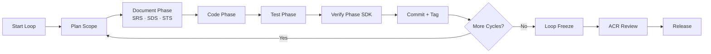
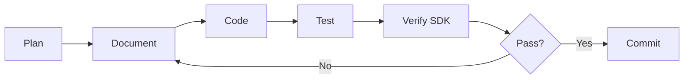
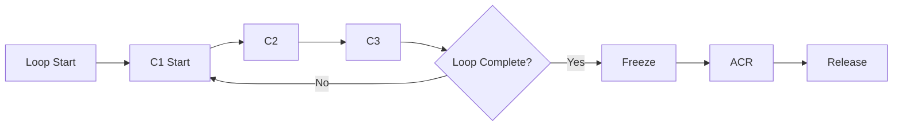

# AIDDM Development Lifecycle Specification v1.0

## 1. Purpose

This document defines the **AIDDM Development Lifecycle**, describing how Loops, Cycles, governance gates, AI workflows, and version rules collaborate to drive a fully document-driven development process.

This specification is normative for all AIDDM-compliant systems and is required for both AIDDM-CE and enterprise implementations.

---

## 2. Position in the Methodology

The Lifecycle Specification interacts with:

- **Document Chain Specification v1.0** — defines WHAT documents exist.  
- **Governance Model Specification v1.0** — defines rules and approvals.  
- **Templates v1.0** — define HOW documents must be structured.  
- **AIDDM SDK / MCP** — validates and enforces lifecycle rules.

Together, these form the foundation of AI Document-Driven Development.

---

# 3. Core Lifecycle Concepts

## 3.1 Loop (L01, L02, …)
A **Loop** represents a major development unit, typically 1–4 weeks, covering:

- Feature groups  
- Domain modules  
- Architecture improvements  
- Refactoring waves  

Each Loop has explicit deliverables, including a frozen SRS/SDS/STS.

---

## 3.2 Cycle (C1, C2, …)
A **Cycle** is the operational iteration inside a Loop.

A Cycle represents one complete iterative pass:

```
Plan → Document → Code → Test → Verify → Commit
```

Cycle typically span **4 hours ~ 2 days**.

---

## 4. High-Level Lifecycle Flow

AIDDM development follows this high-level flow:



---

## 5. Loop Definition

### 5.1 Loop Deliverables

Each Loop **MUST** deliver:

- Updated & validated SRS / SDS / STS
- Updated Code & Tests
- TR (Test Report)
- ACR (Acceptance Criteria Report)
- VDP (Version Development Plan)

### 5.2 Loop Start Conditions

A Loop **MAY** start only when:

- VDP for the loop is defined
- Previous loop is frozen
- Document Chain version alignment is valid
- SDK validation environment is ready

### 5.3 Loop Freeze Conditions

A Loop Freeze requires:

- SRS/SDS/STS all frozen
- No new FR / BR / NFR added
- All Cycles completed
- Tests passing & coverage sufficient
- TR + ACR generated
- Version alignment verified (SDK)

---

## 6. Cycle Definition

A Cycle is a micro-iteration inside a Loop.

### 6.1 Cycle Phases

- **Plan** — tasks, FR/NFR, scope
- **Document** — SRS/SDS/STS updates
- **Code** — implement SDS design
- **Test** — implement STS scenarios
- **Verify** — SDK structural & linkage validation
- **Commit** — commit + tag alignment

### 6.2 Cycle Workflow Diagram



### 6.3 Cycle Naming Convention

- Standard cycles: `C1`, `C2`, `C3`, …
- Hotfix cycles: `C-HF1`, `C-HF2`, …
- Cycle name **MUST** appear in:
  - frontmatter (cycle:)
  - commit message
  - TR/ACR identifiers
  - SDK validation context

---

## 7. AI & SDK Integration Points

### 7.1 AI Responsibilities

AI assists in:

- SRS drafting / revision
- SDS structural generation
- STS expansion
- Code skeleton generation
- Test generation
- TR/ACR summaries

### 7.2 SDK Responsibilities

SDK validates:

- Document structure
- Metadata completeness
- ID linking (SRS→SDS→STS→Code→Test→TR→ACR)
- Version alignment
- Patch version direction
- Coverage and mapping completeness

---

## 8. Freeze Points

AIDDM defines four formal freeze points:

| Freeze Type        | Purpose                                 |
| ------------------ | --------------------------------------- |
| **SRS Freeze**     | Scope is locked for the loop            |
| **SDS Freeze**     | Architecture/design frozen              |
| **STS Freeze**     | Test specification frozen               |
| **Release Freeze** | Loop is complete, ready for ACR/Release |

Terminology is now aligned with Governance Model (Scope Freeze replaces Scope Lock).

---

## 9. Multi-Version & Multi-Loop Governance

### 9.1 Major.Minor Version Alignment (Normative)

Within a loop, major.minor versions MUST be identical across the Document Chain:

```yaml
SRS 1.2.x
SDS 1.2.x
STS 1.2.x
Code 1.2.x
ACR 1.2.x
TR 1.2.x
```

### 9.2 Patch Version Rules (Normative)

Downstream document patch versions MUST be ≥ upstream patch versions.

Examples:

- SDS ≥ SRS
- STS ≥ SDS
- Test ≥ STS
- TR ≥ Test
- ACR ≥ TR

This ensures directional version evolution and prevents downstream artifacts from being older than their upstream sources.

---

## 10. Loop → Cycle → Release Transition



---

## 11. Hotfix Cycle (Emergency Path)

- Named as `C-HF1`, `C-HF2`, …
- Only minimum required documents updated:
  - STS, Code, Test, TR
  - SRS/SDS updated only if requirement/design changes
- **ALWAYS** increases patch version
- **MUST** generate new TR + ACR
- **MUST** pass full SDK validation
- **MUST** merge back into main Loop

---

## 12. Governance Interaction Points

| Lifecycle Phase | Governance Requirement       |
| --------------- | ---------------------------- |
| Document Phase  | SRS/SDS/STS approval         |
| Verify Phase    | SDK validation gates         |
| Loop Freeze     | Governance freeze validation |
| Release         | ACR approval required        |

Governance Model v1.0 defines the exact checkpoint rules.

---

## 13. Status & Future Extensions

This is **Lifecycle Specification v1.0.**

Future versions **MAY** include:

- Automated conflict detection
- AI-driven version audit
- Autonomous loop execution
- Multi-branch coordination models
